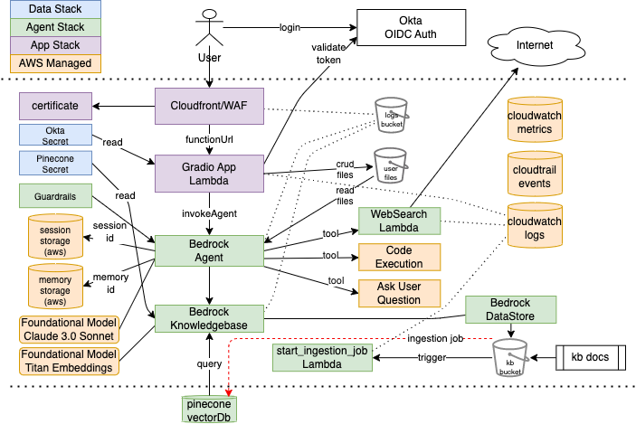
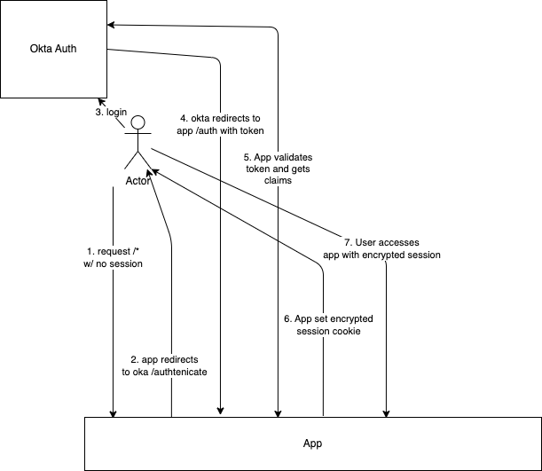

# Bedrock Agent Application

Testing using bedrock, agents, knowledgebases etc to make an agent

## Considerations

1. This requires a pinecone api key. Get one from <https://www.pinecone.io/>

2. The pinecone api secret is stored in secrets manager secret. The first deployment will fail due to permissions error.

    ```shell
    $ cdk deploy --require-approval never --no-rollback

    ...Resource handler returned message: "The knowledge base storage configuration provided is invalid... The vector database encountered an error while processing the request: Wrong API key...
    ```

    Update the secret with the value of the secret and retry

3. The pinecone secret must be formatted like {"apiKey": "PINECONE_SECRET"} or you'll get a storage validation error on knowledgebase

## Presentation Outline

1. What are Agents and why do we need them
    - One Shot LLMs are usually too limited
      - demo of chatgpt 4o (searches internet and has short term and long term memory)
      - demo of gpt4 using apis (no search tools, no memory) < This is what developers have to start with
    - Agentic frameworks enable multi-shot queries and empowers LLM with tools
      - Multi-shot - multiple roles, fact checking, summarization
      - Tools - rag, web search, code exection, function calls
      - Downsides - multi-shot is more expensive and slower
    - Additional features required for LLM applications usually written into application
      - RAG - Retrieval Augemented Generation (enrich prompt with query data)
      - function calling - LLM returns structured data which can be passed directly into a function (dev must orchestrate this)
      - session memory - remember details of conversation as it progresses (short term storage)
      - long term memory - remember conversation way into the future (long term storage)
2. Agent Frameworks compared
    - Langchain
      - Granddaddy of agentic frameworks (Oct 2022), MIT licensed
      - lots of tools (building blocks) which are chainable together
      - sloppy and rapidly changing api
    - CrewAi
      - Open Source (rides on langchain), released Nov 2023, stabilizing langchain apis some
      - declarative coding, simpler than langchain, uses personas to build a team of agents
      - limited control and visbility
    - AutoGen
      - Microsoft released in Sept 2023, Open Source (Creative Commons which requires attribution), designed primarily for use with OpenAi GPT
      - Nice API, stable code base, allows multiple agents to interact
      - Solves problems primarily be writing and executing code (has security concerns or very limiting sandbox)
    - Bedrock Agents
      - AWS preview in July 2023, full release Nov 2023. Serverless (pay as you go), production ready and supported by AWS
      - Works with Bedrock Foundational model types (Anthropic, Llama, Titan, etc), fine tuned or off-the-shelf
      - Built in support for: RAG, short & long term memory, code execution, tools (AWS Lambda)
      - Integrates nicely into larger AWS ecosystem AWS Authentication, AWS APIs (boto3), Step Functions etc.
      - Production ready - tracing, logging, versioned deployments, cdk/iac ready supported by AWS
3. Agent concepts
   - ReAct (Reason and Act)
4. Bedrock Agent Demo
   - Components
     - App - Gradio (or FastHtml??) chat app running in lambda with function url
     - Model - Using Anthropic Claude 3 Sonnet v1
     - RAG - s3 > pincone (or postgres or opensearch)
     - Tools - web search, url retrieval
     - User input - can prompt user to get more information
     - Code Exection - in a sandbox with user provided data (ie. csv file)
     - Session Memory - automatically enriches prompts with history with a session-id
     - Persistant Storage - fully managed storage with a storage_id (user-id or conversation-id)
     - Gaurd Rails - protects against mis-use - blocks certain Pii data like email and password
       - content filters, denied topics, word filters, sensitive information filters, contextual grounding check
   - Demo
     - Start with empty RAG DB
     - Question
       - "When and where was George Washington born?" (demonstrates models embedded knowledge)
       - "What is my name" (demonstrate session memory that automatically works)
       - "What is today's date?" (deomonstrate code exection)
       - "What was the weather in Omaha 2 weeks ago today?" (Claude 3.0 was trained April 2023. Demonstrate web search to get date, search, and prompt enrich)
       - "What is my name again?" (save information for later use)
       - "What is the status of sfdc case 12345?" (deomstrate calling arbitrary tool with proper params)
       - "What is the date of the CloudShift / Mutual MPSA?" (will fail)
     - Load the KB with Moo/Css master agreement - demonstrate auto-indexing
       - "What is the date of the CloudShift / Mutual MSA?" (will succeed)
       - "What are the next 3 prime numbers after 43" (demonstrate code creation and execution)
       - "Analize the attached xxx file and determine yyy" (demonstrate code interpretation of CSV, XLS, XLSX, YAML, JSON, DOC, DOCX, HTML, MD, TXT, and PDF files)
       - "What is Tim Darnall's role at Mutual of Omaha" (should get blocked due to Gaurd rails)
     - Close Browser, log in again with same user (new session id)
       - "What is my name?" (demonstrates long term storage)
   - Other Bedrock Features
     - Custom Agent Prompts
     - Model evaluation
     - Multimodel (images)
     - Integration with other AWS services (texttract, translate)
     - Provisioned Throughput - provisions a higher level of throughput for a model at a fixed cost.
     - Security
       - end to end encryption automatic
       - IAM integration for access controls
       - Prompt Injection security - like SQL injection, it is developer responsibility to sanitize inputs. Code analysis tools dont do this for us yet. Hyper-vigilence required.
     - Logging
       - Knowledgebase Logging - CloudWatch Logs, Amazon S3, or Amazon Data Firehose
       - ModelInvocation Logging - collects invocation logs, model input data, and model output data for all invocations to s3
       - Cloudwatch Metrics - runtime metrics like invocation count, latency, errors, throttles, token counts etc
       - Bedrock Events - publish notifications to eventbridge when change state change events occur and deliver model customization job statuses without having to call GetModelCustomizationJob()
       - Cloudtrail Logging - captures all API calls for Amazon Bedrock as events
5. Possible Use Cases
   - JP Morgan Chase internal "chat gpt" - https://www.cnbc.com/2024/08/09/jpmorgan-chase-ai-artificial-intelligence-assistant-chatgpt-openai.html
   - Internal IT Knowledge base (CPT Office Hours)
   - Customer Service
   - ???

## Archtecture



## Ouath

